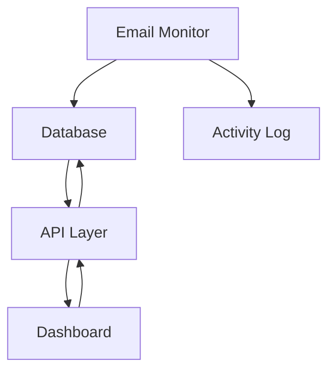
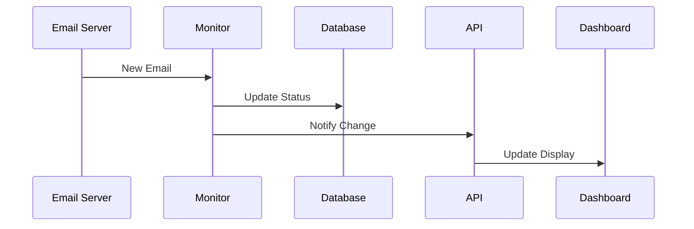
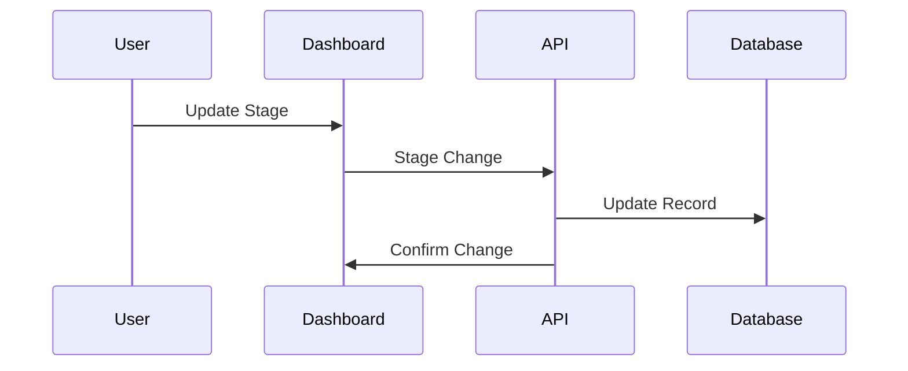

# Sales Automation System Architecture

## System Overview

The Sales Automation System is built on a modern web architecture that combines real-time monitoring, data processing, and user interaction through a responsive dashboard.

## Core Components

### 1. Dashboard Server (`dashboard_server.py`)
- Flask-based web server
- Serves the main dashboard interface
- Handles user authentication
- Routes API requests to appropriate handlers

### 2. API Layer (`quick_api.py`)
- RESTful API endpoints
- JWT authentication
- CRUD operations for prospects
- Metrics calculation and aggregation
- Stage management

### 3. Email Monitor (`quick_monitor.py`)
- Background service
- Monitors email interactions
- Updates prospect statuses
- Records activities
- Triggers notifications

### 4. Database (`sales_automation.db`)
- SQLite database
- Tables:
  - prospects
  - interactions
  - metrics
  - activities
  - users

## Data Flow

## Security Architecture

1. Authentication
   - JWT tokens for API access
   - Session management
   - Role-based access control

2. Data Protection
   - Environment variables for secrets
   - Input validation
   - SQL injection prevention
   - XSS protection

## Process Workflow

### 1. Email Processing

### 2. Prospect Management

## System Requirements

### Hardware
- Minimum 2GB RAM
- 1GB disk space
- Network connectivity

### Software
- Python 3.8+
- SQLite3
- Modern web browser
- Email server access

## Development Guidelines

### 1. Code Organization
- Follow PEP 8 for Python
- Use ESLint for JavaScript
- Maintain clear module separation
- Document all API endpoints

### 2. Testing Strategy
- Unit tests for core functions
- Integration tests for API
- End-to-end tests for workflows
- Performance testing for dashboard

### 3. Deployment Process
1. Code review
2. Test suite execution
3. Staging deployment
4. Production release

## Monitoring and Maintenance

### 1. System Health
- API response times
- Email processing delays
- Database performance
- Error rates

### 2. Data Management
- Regular backups
- Data cleanup routines
- Index optimization
- Cache management

## Error Handling

### 1. API Errors
- Standard error codes
- Detailed error messages
- Error logging
- Retry mechanisms

### 2. Email Processing
- Connection retries
- Invalid email handling
- Rate limiting
- Bounce management

## Performance Considerations

### 1. Dashboard
- Efficient data loading
- Pagination
- Caching
- Lazy loading

### 2. Database
- Index optimization
- Query optimization
- Connection pooling
- Regular maintenance

## Future Enhancements

1. Scalability
   - Distributed processing
   - Load balancing
   - Horizontal scaling

2. Features
   - AI-powered analytics
   - Advanced reporting
   - Integration capabilities
   - Mobile support

## Documentation

### 1. Code Documentation
- Inline comments
- Function documentation
- Module documentation
- API documentation

### 2. User Documentation
- Installation guide
- User manual
- API reference
- Troubleshooting guide

## Compliance and Standards

1. Code Quality
   - PEP 8 compliance
   - ESLint rules
   - Code review process
   - Testing coverage

2. Security
   - OWASP guidelines
   - Data protection
   - Access control
   - Audit logging
